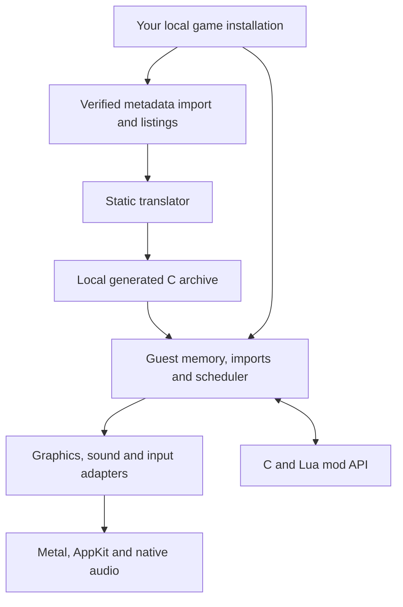

# Architecture

The build translates the supported executable's x86 instructions into C, then
compiles that C alongside a handwritten native runtime. At runtime the executable
supplies the original data image; its machine instructions are not executed by an
x86 emulator. The loader verifies its hash before mapping any of it.

## Guest memory and calls

`runtime/memory.cpp` owns the guest address arena and allocator. Guest pointers
remain 32-bit offsets even in a 64-bit process. `loader.cpp` maps PE sections,
zero-fills data tails and replaces import-table entries with runtime trampolines.
`imports.cpp` decodes calls and dispatches the original calling conventions.

`tools/recomp/runtime/x86.h` defines the register file, flags, x87 state and
instruction helpers used by generated functions. Functions retain stable guest
addresses for dispatch, hooks and diagnostics. Those addresses are identifiers,
not host pointers and not evidence of human-recovered intent.

## Threads and ownership

Original game threads are cooperatively scheduled by `runtime/kernel32.cpp`.
Each has a register file and stack, but **one guest thread holds the execution
baton at a time**. A blocking import yields it. Host workers never mutate guest
memory concurrently with that thread.

The presentation worker consumes completed immutable frames. GPU resources and
texture revisions remain alive until commands that reference them complete.
Audio queues use their own clock and synchronization. AppKit events publish
requests for the guest thread rather than directly executing guest functions.

## A frame through the host

1. The original game submits DirectDraw/Direct3D operations to `dx/`.
2. `host/d3d_render.mm` translates draws and texture revisions into Metal commands.
3. `host/ui_layer.mm` extracts UI elements from recorded blits.
4. `host/present_thread.mm` seals the frame, retains its resources and queues it.
5. `host/compositor.mm` combines world, UI and overlays for presentation.
6. Completion acknowledgements release resources and update frame-pacing samples.

Classic renders at the selected game resolution and aspect-fits the image.
Enhanced can render the world at drawable resolution with separately scaled UI.
Wide view expands the world only when the drawable is wider than the selected
game canvas. [Display settings](DISPLAY.md) describes the visible behavior.

## Timing, input and settings

The render limit and animation clock are separate from the simulation clock.
Increasing the presentation limit must not advance game logic or animations faster.
`mods/animation_timing.cpp` redirects only reviewed visual clock reads.

`host/input_gate.cpp` maps window coordinates through the published frame layout,
corrects the original relative cursor, and handles edge scrolling and focus.
`mods/options_menu.cpp` extends the original Options page and queues changes at
guest-safe boundaries. `mods/game_settings.cpp` persists original graphics choices;
`mods/settings.cpp` atomically persists host/mod settings in the selected profile.

## Current boundaries

The original simulation is generated code, not a hand-rewritten gameplay engine.
It intentionally retains low-level register operations. The handwritten runtime,
adapter APIs, build tools and reviewed extension points are the primary places to
contribute. Generated functions have address/symbol comments and per-instruction
provenance; change the translator or a reviewed replacement, then regenerate.

The native app currently targets macOS. `src/core/` contains only shared type
headers used by the retained tests; it is not a second game engine. Capture/replay
under `src/recomp/native/` validates prospective native replacements locally.

Platform services (threads, virtual memory, plugins, files, clocks) go through
`src/recomp/platform/os.h`, with POSIX and Win32 implementations; the build is
CMake with presets per platform (`CMakePresets.json`).
